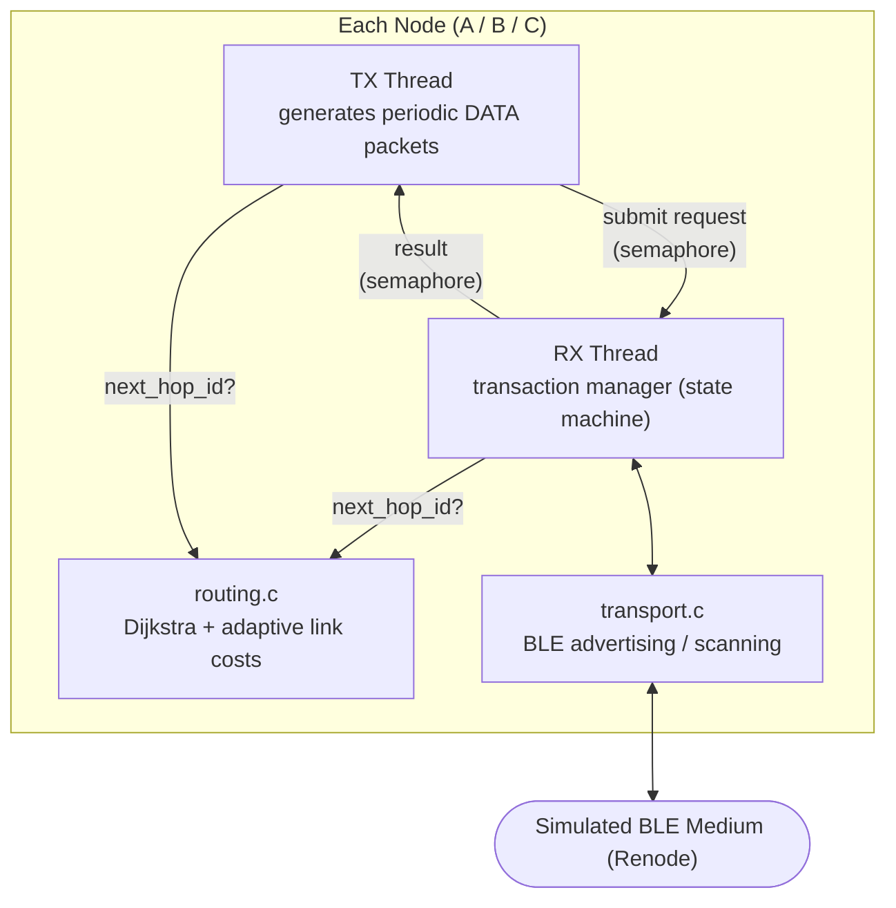
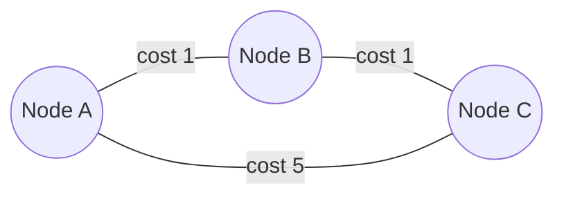

# Bluetooth Dijkstra Mesh

A simplified BLE mesh network simulation demonstrating **Dijkstra-based hop-by-hop routing** with **reliable transmission** and **adaptive link-cost rerouting**, built on Zephyr RTOS and simulated entirely in Renode

Three virtual nodes (A, B, C) exchange messages over simulated BLE advertising. Each node independently runs Dijkstra's algorithm on a local copy of the network graph to decide the next hop for every packet. When a link degrades (simulated packet loss), the affected node detects it through missing acknowledgments, raises that link's cost, and automatically reroutes future traffic through a cheaper path — a live demonstration of adaptive routing under changing network conditions.

Dưới đây là phần văn bản để bạn copy và tự chỉnh sửa, thay cho bảng "Development Milestones":

---

## Milestone Breakdown

The project was built incrementally through five milestones (M0–M4), each one a strict prerequisite for the next. Rather than attempting the full system in one pass, every milestone was scoped to isolate a single new capability and required a working, runnable result — a clear Definition of Done — before moving on. This made debugging tractable: when something broke, the search space was limited to whatever had been added in that specific milestone, rather than the entire stack at once.

**M0 — Toolchain and simulation bring-up.** Before writing any application logic, the goal was simply to get a Zephyr "hello world" image built and booting inside Renode. This validated the entire toolchain (Zephyr SDK, `west`, board target, Renode integration) independently of any project-specific code, so that later milestones could assume the environment itself was not the source of bugs.

**M1 — Single-node threading model.** With the environment confirmed working, this milestone introduced the concurrency model on a single simulated node: a TX thread and an RX thread communicating through an internal message queue, with the node's identity (`NODE_ID`) configured through Kconfig rather than hardcoded. No networking was involved yet — the goal was to prove the threading and configuration approach in isolation before adding radio communication into the mix.

**M2 — Real BLE communication between nodes.** This milestone replaced the internal message queue with actual over-the-air communication: three nodes exchanging data via BLE advertising and scanning (Broadcaster/Observer roles). The focus here was strictly on getting real inter-node communication working — a simple, temporary payload format was used, deferring the question of a proper packet protocol to the next milestone.

**M3 — Real multi-hop routing.** With reliable point-to-point communication in place, this milestone introduced the actual mesh behavior: a formal packet format carrying routing metadata, and a real Dijkstra implementation deciding the next hop at every node. Critically, the network topology was deliberately built so that not every pair of nodes has a direct link — forcing at least one multi-hop forward and proving that routing decisions are genuinely being computed, not just a direct broadcast that happens to be received everywhere.

**M4 — Reliability and adaptive routing.** The final milestone moved the system from a static router to an adaptive one. It added hop-by-hop acknowledgments, timeouts, and bounded retries to detect when a link is failing, translated repeated failures into a rising cost for that link, and let Dijkstra's next calculation naturally route around it. This is the milestone that distinguishes the project from a simple shortest-path demo: it shows the routing decision responding to real-time network conditions rather than only ever running once against a fixed graph.

## Key Features

- **Custom mesh packet protocol** carried over BLE advertising/scanning (Broadcaster + Observer roles — no BLE connections)
- **Hop-by-hop Dijkstra routing** — each node holds its own local graph and independently computes the next hop; no source routing, no centralized controller
- **Reliable transmission layer** — ACK, timeout, and bounded retry implemented as a non-blocking state machine, avoiding a classic self-deadlock where the receiving thread would otherwise be the only one able to read its own acknowledgment
- **Adaptive link-cost routing** — a link's cost doubles on packet loss and resets on successful delivery, so Dijkstra's next calculation automatically favors healthier paths
- **Fault injection** — a configurable, compile-time flag lets one node deliberately drop incoming packets from a specific neighbor, producing a reproducible link-degradation scenario for demos
- **Fully simulated** — three independent Zephyr instances run concurrently in Renode over a shared virtual BLE medium, with per-node UART logs for observability

## Architecture

Each node runs the same firmware image, differentiated only by a build-time `NODE_ID`. Internally, two threads cooperate through a small, well-defined interface:



- **`transport.c`** — the only file that touches the BLE API. Wraps advertising/scanning into a plain send/receive byte interface; knows nothing about routing or reliability.
- **`routing.c`** — a generic O(N²) Dijkstra implementation operating on a small adjacency matrix. Costs can change at runtime; the algorithm itself never needed to change to support that.
- **`main.c`** — application logic: packet semantics, the ACK/retry/timeout state machine, fault injection, and the glue between TX and RX threads.
- **`packet.h`** — the wire format shared by every node, reused for both data packets and their acknowledgments.

The RX thread doubles as the **reliable-transmission transaction manager**: it processes at most one outstanding send at a time (send → wait for ACK → retry → give up or succeed), while remaining free to keep receiving packets in between — a design that avoids blocking the one thread capable of reading incoming acknowledgments.

## Network Topology



A and C have no cheap direct route by default, so traffic between them normally flows through B. The A–C link exists specifically as a costlier fallback: when A–B degrades enough, Dijkstra picks A–C instead, giving a clear before/after rerouting demonstration.

## How Rerouting Happens

```
Link A-B starts healthy (cost 1)
        │
   packet loss detected (no ACK after retry)
        │
   cost doubles: 1 → 2 → 4 → 8
        │
   A→B→C total cost (9) now exceeds A→C direct cost (5)
        │
   Dijkstra recalculates → routes via A→C instead
```

Cost changes are local to the node that observes them — there is no propagation between nodes' routing tables, matching the fully decentralized, hop-by-hop nature of the design.

## Getting Started

### Prerequisites

- [Zephyr RTOS](https://docs.zephyrproject.org/latest/develop/getting_started/index.html) development environment (SDK, `west`, Python virtual environment)
- [Renode](https://renode.io/) for simulation
- A configured Zephyr workspace with this project checked out as an application

### Build & Run

```bash
chmod +x scripts/build_and_run_m4.sh
./scripts/build_and_run_m4.sh
```

This builds all three nodes (with Node B's fault-injection flag controlled by a variable near the top of the script) and launches the three-node simulation in Renode. Per-node UART output and build logs are written under `logs/`.

To toggle fault injection manually for a single node:

```bash
west build -b nrf52840dk/nrf52840 app -d build_b -- \
  -DCONFIG_APP_NODE_ID=1 -DCONFIG_APP_FAULT_INJECTION=y
```

### Running the Routing Unit Tests

The Dijkstra implementation can be tested independently of Zephyr/Renode:

```bash
gcc -DROUTING_HOST_TEST tests/routing_host/test_routing.c app/src/routing.c -o test_routing
./test_routing
```

## Known Limitations

This project intentionally favors a simple, working design over full production-grade robustness, within the scope of a 3-node demonstration:

- **Single active transaction per node** — each node handles one send/ACK cycle at a time; concurrent traffic is serialized rather than pipelined.
- **Application-level fault injection only** — link failure is simulated by having a node deliberately drop specific incoming packets, not by modeling real RF-level interference.
- **Non-propagating link costs** — a node's view of link quality is local; it is not shared or gossiped with other nodes.
- **Retry vs. duplicate-detection interaction** — under certain timing conditions, a retried packet can be mistaken for a physical-layer duplicate of the original transmission, which may register as a lost packet even when delivery actually succeeded.
- **No overflow protection on the receive queue** — under sustained load, incoming packets can be silently dropped if the queue fills up.

## Tech Stack

- **Zephyr RTOS** (v3.7 LTS) — real-time embedded operating system
- **Renode** — full-system hardware simulation (nRF52840, virtual BLE medium)
- **C** — application and driver-level code
- **BLE (Bluetooth Low Energy)** — Broadcaster/Observer roles for mesh-style flooding
